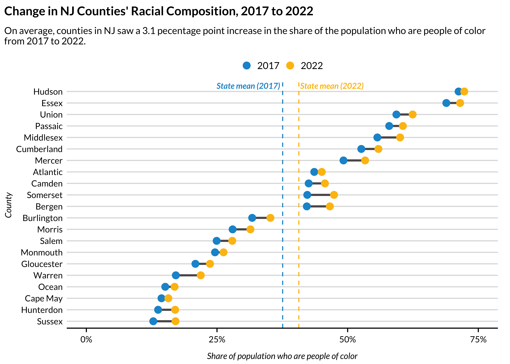

<!-- README.md is generated from README.Rmd. Please edit that file -->

# urbnindicators

<!-- badges: start -->
<!-- badges: end -->

The goal of `urbnindicators` is to provide users with a simple interface
to generate a ready-for-analysis dataset of common social sciences
measures. It is built on top of the `tidycensus` package and abstracts
common query and cleaning tasks–such as identifying required variable
codes to pass to `tidycensus::get_acs()`, calculating percentages and
other measures of interest that are derived from count estimates, and
renaming variables such that they are semantically-meaningful (but still
programmatically functional). In addition to simplicity, it includes a
series of data quality checks to help ensure that measures are
accurately computed and to provide users with quantifications of
measures’ reliability (using coefficients of variation) rather than
merely returning margins of error (which are often immediately dropped
from analysis workflows without further consideration.

(aspirational) `urbnindicators` also provides a set of related tools to
facilitate common tasks when working with Census data (and ACS data in
particular), such as calculating calculating measures of segregation,
interpolating data across geographies and over time, and providing
change-over-time measures.

## Installation

Install the development version of urbnindicators from
[GitHub](https://github.com/) with:

``` r
# install.packages("devtools")
devtools::install_github("UI-Research/urbnindicators")
```

This package is under active development with frequent updates–check to
ensure you have the most recent version installed!

## urbnindicators in action

``` r
suppressPackageStartupMessages({
  library(dplyr)
  library(stringr)
  library(urbnindicators)
  library(ggplot2)
})

acs_df = compile_acs_data(
  variables = NULL,
  years = c(2021, 2022),
  geography = "county",
  states = "NJ",
  counties = NULL,
  retain_moes = TRUE)

#> Getting data from the 2017-2021 5-year ACS
#> Getting data from the 2018-2022 5-year ACS

acs_df %>% 
  select(NAME, data_source_year, race_personofcolor_percent) %>%
  mutate(county_name = NAME %>% str_remove(" County, New Jersey")) %>%
  ggplot(aes(
    x = reorder(county_name, race_personofcolor_percent), 
    y = race_personofcolor_percent, 
    color = factor(data_source_year))) +
    geom_point() +
    labs(
      title = "Change in NJ Counties' Populations of Color, 2021 to 2022",
      x = "County", 
      y = "Share of population who are people of color",
      color = "Year") +
    scale_y_continuous(
      breaks = c(0, .25, .50, .75, 1.0),
      labels = scales::percent) +
    coord_flip() +
    theme_minimal() +
    theme(
      axis.title = element_text(size = 9, face = "italic"),
      plot.title = element_text(size = 11, face = "bold"),
      panel.grid.minor = element_blank(),
      panel.grid.major.x = element_blank(),
      legend.title = element_text(size = 9, face = "bold"),
      legend.text = element_text(size = 8))
```


