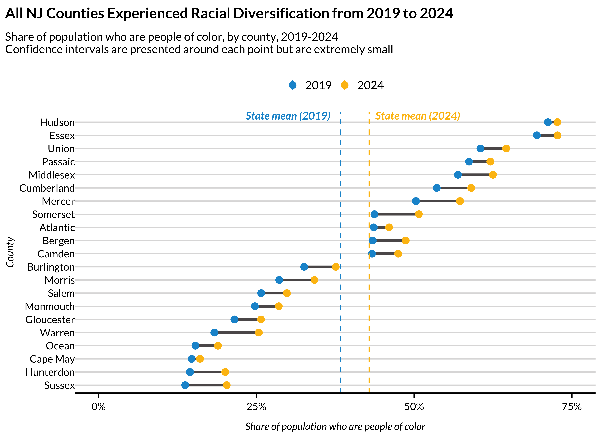

<!-- README.md is generated from README.Rmd. Please edit that file -->

# urbnindicators

<!-- badges: start -->

[](https://lifecycle.r-lib.org/articles/stages.html#experimental)
[](https://www.gnu.org/licenses/gpl-3.0)
[](https://app.codecov.io/gh/UI-Research/urbnindicators)

<!-- badges: end -->

# Overview

**urbnindicators** aims to provide users with analysis-ready data from
the American Community Survey (ACS).

With a single function call, you get:

- Access to hundreds of standardized variables, such as percentages and
  the raw count variables used to produce them.

- Margins of error for all variables–those direct from the API as well
  as derived variables.

- Meaningful, consistent variable names.

- A codebook that describes how each variable is calculated.

- The built-in capacity to pull data for multiple years and multiple
  states.

- Supplemental measures, such as population density, that aren’t
  available from the ACS.

- Built-in quality checks to help ensure that calculated variables and
  measures of error are accurate. Plus some good, old-fashioned manual
  QC. That said–use at your own risk. We cannot and do not guarantee
  there aren’t bugs.

# Installation

Install the development version of `urbnindicators` from
[GitHub](https://github.com/) with:

``` r
# install.packages("renv")
renv::install("UI-Research/urbnindicators")
```

You’ll want a Census API key ([request one
here](https://api.census.gov/data/key_signup.html)). Set it once with:

``` r
tidycensus::census_api_key("YOUR_KEY", install = TRUE)
```

Note that this package is under active development with frequent
updates–check to ensure you have the most recent version installed!

# Use

## Discover Available Data

``` r
list_tables() |> head(10)
#>  [1] "age"                    "computing_devices"      "cost_burden"           
#>  [4] "disability"             "educational_attainment" "employment"            
#>  [7] "gini"                   "health_insurance"       "household_size"        
#> [10] "income_quintiles"
```

``` r
list_variables() |> head(10)
#> # A tibble: 10 × 2
#>    variable                                table            
#>    <chr>                                   <chr>            
#>  1 total_population_universe               total_population 
#>  2 public_assistance_universe              public_assistance
#>  3 public_assistance_received              public_assistance
#>  4 public_assistance_received_percent      public_assistance
#>  5 snap_universe                           snap             
#>  6 snap_received                           snap             
#>  7 snap_received_percent                   snap             
#>  8 household_income_quintile_upper_limit_1 income_quintiles 
#>  9 household_income_quintile_upper_limit_2 income_quintiles 
#> 10 household_income_quintile_upper_limit_3 income_quintiles
```

## Obtain Data

A single call to `compile_acs_data()` returns analysis-ready data with
pre-computed percentages, meaningful variable names, and margins of
error:

``` r
df = compile_acs_data(
  tables = "race",
  years = 2024,
  geography = "county",
  states = "NJ")

glimpse(df) |> head(10)
#> Rows: 21
#> Columns: 175
#> $ data_source_year                                         <dbl> 2024, 2024, 2…
#> $ GEOID                                                    <chr> "34001", "340…
#> $ NAME                                                     <chr> "Atlantic Cou…
#> $ total_population_universe                                <dbl> 276270, 96231…
#> $ race_universe                                            <dbl> 276270, 96231…
#> $ race_nonhispanic_allraces                                <dbl> 219985, 74346…
#> $ race_nonhispanic_white_alone                             <dbl> 149114, 49395…
#> $ race_nonhispanic_black_alone                             <dbl> 34841, 51787,…
#> $ race_nonhispanic_aian_alone                              <dbl> 738, 595, 107…
#> $ race_nonhispanic_asian_alone                             <dbl> 21415, 161731…
#> $ race_nonhispanic_nhpi_alone                              <dbl> 29, 186, 64, …
#> $ race_nonhispanic_otherrace_alone                         <dbl> 1434, 7569, 3…
#> $ race_nonhispanic_twoormore                               <dbl> 12414, 27633,…
#> $ race_nonhispanic_twoormore_includingotherrace            <dbl> 1696, 8038, 6…
#> $ race_nonhispanic_twoormore_excludingotherrace            <dbl> 10718, 19595,…
#> $ race_hispanic_allraces                                   <dbl> 56285, 218856…
#> $ race_hispanic_white_alone                                <dbl> 5923, 36191, …
#> $ race_hispanic_black_alone                                <dbl> 2269, 4341, 2…
#> $ race_hispanic_aian_alone                                 <dbl> 1223, 2142, 8…
#> $ race_hispanic_asian_alone                                <dbl> 266, 730, 210…
#> $ race_hispanic_nhpi_alone                                 <dbl> 0, 67, 25, 11…
#> $ race_hispanic_otherrace_alone                            <dbl> 24930, 72826,…
#> $ race_hispanic_twoormore                                  <dbl> 21674, 102559…
#> $ race_hispanic_twoormore_includingotherrace               <dbl> 20211, 92733,…
#> $ race_hispanic_twoormore_excludingotherrace               <dbl> 1463, 9826, 3…
#> $ race_nonhispanic_allraces_percent                        <dbl> 0.7963, 0.772…
#> $ race_nonhispanic_white_alone_percent                     <dbl> 0.5397, 0.513…
#> $ race_nonhispanic_black_alone_percent                     <dbl> 0.1261, 0.053…
#> $ race_nonhispanic_aian_alone_percent                      <dbl> 0.0027, 0.000…
#> $ race_nonhispanic_asian_alone_percent                     <dbl> 0.0775, 0.168…
#> $ race_nonhispanic_nhpi_alone_percent                      <dbl> 0.0001, 0.000…
#> $ race_nonhispanic_otherrace_alone_percent                 <dbl> 0.0052, 0.007…
#> $ race_nonhispanic_twoormore_percent                       <dbl> 0.0449, 0.028…
#> $ race_nonhispanic_twoormore_includingotherrace_percent    <dbl> 0.0061, 0.008…
#> $ race_nonhispanic_twoormore_excludingotherrace_percent    <dbl> 0.0388, 0.020…
#> $ race_hispanic_allraces_percent                           <dbl> 0.2037, 0.227…
#> $ race_hispanic_white_alone_percent                        <dbl> 0.0214, 0.037…
#> $ race_hispanic_black_alone_percent                        <dbl> 0.0082, 0.004…
#> $ race_hispanic_aian_alone_percent                         <dbl> 0.0044, 0.002…
#> $ race_hispanic_asian_alone_percent                        <dbl> 0.0010, 0.000…
#> $ race_hispanic_nhpi_alone_percent                         <dbl> 0e+00, 1e-04,…
#> $ race_hispanic_otherrace_alone_percent                    <dbl> 0.0902, 0.075…
#> $ race_hispanic_twoormore_percent                          <dbl> 0.0785, 0.106…
#> $ race_hispanic_twoormore_includingotherrace_percent       <dbl> 0.0732, 0.096…
#> $ race_hispanic_twoormore_excludingotherrace_percent       <dbl> 0.0053, 0.010…
#> $ race_personofcolor_percent                               <dbl> 0.4603, 0.486…
#> $ total_population_universe_M                              <dbl> 0, 0, 0, 0, 0…
#> $ race_universe_M                                          <dbl> 0, 0, 0, 0, 0…
#> $ race_nonhispanic_allraces_M                              <dbl> 0, 0, 0, 0, 0…
#> $ race_nonhispanic_white_alone_M                           <dbl> 638, 1467, 14…
#> $ race_nonhispanic_black_alone_M                           <dbl> 1070, 1068, 1…
#> $ race_nonhispanic_aian_alone_M                            <dbl> 369, 186, 55,…
#> $ race_nonhispanic_asian_alone_M                           <dbl> 614, 1300, 59…
#> $ race_nonhispanic_nhpi_alone_M                            <dbl> 47, 75, 87, 6…
#> $ race_nonhispanic_otherrace_alone_M                       <dbl> 538, 1401, 10…
#> $ race_nonhispanic_twoormore_M                             <dbl> 1255, 1611, 1…
#> $ race_nonhispanic_twoormore_includingotherrace_M          <dbl> 469, 1219, 11…
#> $ race_nonhispanic_twoormore_excludingotherrace_M          <dbl> 1127, 1349, 1…
#> $ race_hispanic_allraces_M                                 <dbl> 0, 0, 0, 0, 0…
#> $ race_hispanic_white_alone_M                              <dbl> 945, 2577, 10…
#> $ race_hispanic_black_alone_M                              <dbl> 624, 818, 440…
#> $ race_hispanic_aian_alone_M                               <dbl> 662, 732, 459…
#> $ race_hispanic_asian_alone_M                              <dbl> 171, 222, 138…
#> $ race_hispanic_nhpi_alone_M                               <dbl> 33, 73, 41, 1…
#> $ race_hispanic_otherrace_alone_M                          <dbl> 1853, 3745, 1…
#> $ race_hispanic_twoormore_M                                <dbl> 2045, 3799, 1…
#> $ race_hispanic_twoormore_includingotherrace_M             <dbl> 2006, 3662, 1…
#> $ race_hispanic_twoormore_excludingotherrace_M             <dbl> 456, 1526, 72…
#> $ total_population_universe_SE                             <dbl> 0, 0, 0, 0, 0…
#> $ race_universe_SE                                         <dbl> 0, 0, 0, 0, 0…
#> $ race_nonhispanic_allraces_SE                             <dbl> 0, 0, 0, 0, 0…
#> $ race_nonhispanic_white_alone_SE                          <dbl> 387.8419, 891…
#> $ race_nonhispanic_black_alone_SE                          <dbl> 650.4559, 649…
#> $ race_nonhispanic_aian_alone_SE                           <dbl> 224.3161, 113…
#> $ race_nonhispanic_asian_alone_SE                          <dbl> 373.2523, 790…
#> $ race_nonhispanic_nhpi_alone_SE                           <dbl> 28.5714, 45.5…
#> $ race_nonhispanic_otherrace_alone_SE                      <dbl> 327.0517, 851…
#> $ race_nonhispanic_twoormore_SE                            <dbl> 762.9179, 979…
#> $ race_nonhispanic_twoormore_includingotherrace_SE         <dbl> 285.1064, 741…
#> $ race_nonhispanic_twoormore_excludingotherrace_SE         <dbl> 685.1064, 820…
#> $ race_hispanic_allraces_SE                                <dbl> 0, 0, 0, 0, 0…
#> $ race_hispanic_white_alone_SE                             <dbl> 574.4681, 156…
#> $ race_hispanic_black_alone_SE                             <dbl> 379.3313, 497…
#> $ race_hispanic_aian_alone_SE                              <dbl> 402.4316, 444…
#> $ race_hispanic_asian_alone_SE                             <dbl> 103.9514, 134…
#> $ race_hispanic_nhpi_alone_SE                              <dbl> 20.0608, 44.3…
#> $ race_hispanic_otherrace_alone_SE                         <dbl> 1126.4438, 22…
#> $ race_hispanic_twoormore_SE                               <dbl> 1243.1611, 23…
#> $ race_hispanic_twoormore_includingotherrace_SE            <dbl> 1219.4529, 22…
#> $ race_hispanic_twoormore_excludingotherrace_SE            <dbl> 277.2036, 927…
#> $ race_nonhispanic_allraces_percent_SE                     <dbl> 0, 0, 0, 0, 0…
#> $ race_nonhispanic_white_alone_percent_SE                  <dbl> 0.0014, 0.000…
#> $ race_nonhispanic_black_alone_percent_SE                  <dbl> 0.0024, 0.000…
#> $ race_nonhispanic_aian_alone_percent_SE                   <dbl> 8e-04, 1e-04,…
#> $ race_nonhispanic_asian_alone_percent_SE                  <dbl> 0.0014, 0.000…
#> $ race_nonhispanic_nhpi_alone_percent_SE                   <dbl> 1e-04, 0e+00,…
#> $ race_nonhispanic_otherrace_alone_percent_SE              <dbl> 0.0012, 0.000…
#> $ race_nonhispanic_twoormore_percent_SE                    <dbl> 0.0028, 0.001…
#> $ race_nonhispanic_twoormore_includingotherrace_percent_SE <dbl> 0.0010, 0.000…
#> $ race_nonhispanic_twoormore_excludingotherrace_percent_SE <dbl> 0.0025, 0.000…
#> $ race_hispanic_allraces_percent_SE                        <dbl> 0, 0, 0, 0, 0…
#> $ race_hispanic_white_alone_percent_SE                     <dbl> 0.0021, 0.001…
#> $ race_hispanic_black_alone_percent_SE                     <dbl> 0.0014, 0.000…
#> $ race_hispanic_aian_alone_percent_SE                      <dbl> 0.0015, 0.000…
#> $ race_hispanic_asian_alone_percent_SE                     <dbl> 4e-04, 1e-04,…
#> $ race_hispanic_nhpi_alone_percent_SE                      <dbl> 1e-04, 0e+00,…
#> $ race_hispanic_otherrace_alone_percent_SE                 <dbl> 0.0041, 0.002…
#> $ race_hispanic_twoormore_percent_SE                       <dbl> 0.0045, 0.002…
#> $ race_hispanic_twoormore_includingotherrace_percent_SE    <dbl> 0.0044, 0.002…
#> $ race_hispanic_twoormore_excludingotherrace_percent_SE    <dbl> 0.0010, 0.001…
#> $ race_personofcolor_percent_SE                            <dbl> 0.0014, 0.000…
#> $ total_population_universe_CV                             <dbl> 0, 0, 0, 0, 0…
#> $ race_universe_CV                                         <dbl> 0, 0, 0, 0, 0…
#> $ race_nonhispanic_allraces_CV                             <dbl> 0, 0, 0, 0, 0…
#> $ race_nonhispanic_white_alone_CV                          <dbl> 0.2601, 0.180…
#> $ race_nonhispanic_black_alone_CV                          <dbl> 1.8669, 1.253…
#> $ race_nonhispanic_aian_alone_CV                           <dbl> 30.3951, 19.0…
#> $ race_nonhispanic_asian_alone_CV                          <dbl> 1.7429, 0.488…
#> $ race_nonhispanic_nhpi_alone_CV                           <dbl> 98.5222, 24.5…
#> $ race_nonhispanic_otherrace_alone_CV                      <dbl> 22.8070, 11.2…
#> $ race_nonhispanic_twoormore_CV                            <dbl> 6.1456, 3.544…
#> $ race_nonhispanic_twoormore_includingotherrace_CV         <dbl> 16.8105, 9.21…
#> $ race_nonhispanic_twoormore_excludingotherrace_CV         <dbl> 6.3921, 4.185…
#> $ race_hispanic_allraces_CV                                <dbl> 0, 0, 0, 0, 0…
#> $ race_hispanic_white_alone_CV                             <dbl> 9.6989, 4.328…
#> $ race_hispanic_black_alone_CV                             <dbl> 16.7180, 11.4…
#> $ race_hispanic_aian_alone_CV                              <dbl> 32.9053, 20.7…
#> $ race_hispanic_asian_alone_CV                             <dbl> 39.0795, 18.4…
#> $ race_hispanic_nhpi_alone_CV                              <dbl> NA, 66.2342, …
#> $ race_hispanic_otherrace_alone_CV                         <dbl> 4.5184, 3.126…
#> $ race_hispanic_twoormore_CV                               <dbl> 5.7357, 2.251…
#> $ race_hispanic_twoormore_includingotherrace_CV            <dbl> 6.0336, 2.400…
#> $ race_hispanic_twoormore_excludingotherrace_CV            <dbl> 18.9476, 9.44…
#> $ race_nonhispanic_allraces_percent_CV                     <dbl> 0, 0, 0, 0, 0…
#> $ race_nonhispanic_white_alone_percent_CV                  <dbl> 0.2601, 0.180…
#> $ race_nonhispanic_black_alone_percent_CV                  <dbl> 1.8669, 1.253…
#> $ race_nonhispanic_aian_alone_percent_CV                   <dbl> 30.3951, 19.0…
#> $ race_nonhispanic_asian_alone_percent_CV                  <dbl> 1.7429, 0.488…
#> $ race_nonhispanic_nhpi_alone_percent_CV                   <dbl> 98.5222, 24.5…
#> $ race_nonhispanic_otherrace_alone_percent_CV              <dbl> 22.8070, 11.2…
#> $ race_nonhispanic_twoormore_percent_CV                    <dbl> 6.1456, 3.544…
#> $ race_nonhispanic_twoormore_includingotherrace_percent_CV <dbl> 16.8105, 9.21…
#> $ race_nonhispanic_twoormore_excludingotherrace_percent_CV <dbl> 6.3921, 4.185…
#> $ race_hispanic_allraces_percent_CV                        <dbl> 0, 0, 0, 0, 0…
#> $ race_hispanic_white_alone_percent_CV                     <dbl> 9.6989, 4.328…
#> $ race_hispanic_black_alone_percent_CV                     <dbl> 16.7180, 11.4…
#> $ race_hispanic_aian_alone_percent_CV                      <dbl> 32.9053, 20.7…
#> $ race_hispanic_asian_alone_percent_CV                     <dbl> 39.0795, 18.4…
#> $ race_hispanic_nhpi_alone_percent_CV                      <dbl> NA, 66.2342, …
#> $ race_hispanic_otherrace_alone_percent_CV                 <dbl> 4.5184, 3.126…
#> $ race_hispanic_twoormore_percent_CV                       <dbl> 5.7357, 2.251…
#> $ race_hispanic_twoormore_includingotherrace_percent_CV    <dbl> 6.0336, 2.400…
#> $ race_hispanic_twoormore_excludingotherrace_percent_CV    <dbl> 18.9476, 9.44…
#> $ race_personofcolor_percent_CV                            <dbl> 0.3050, 0.190…
#> $ race_nonhispanic_allraces_percent_M                      <dbl> 0, 0, 0, 0, 0…
#> $ race_nonhispanic_white_alone_percent_M                   <dbl> 0.0023, 0.001…
#> $ race_nonhispanic_black_alone_percent_M                   <dbl> 0.0039, 0.001…
#> $ race_nonhispanic_aian_alone_percent_M                    <dbl> 0.0013, 0.000…
#> $ race_nonhispanic_asian_alone_percent_M                   <dbl> 0.0022, 0.001…
#> $ race_nonhispanic_nhpi_alone_percent_M                    <dbl> 0.0002, 0.000…
#> $ race_nonhispanic_otherrace_alone_percent_M               <dbl> 0.0019, 0.001…
#> $ race_nonhispanic_twoormore_percent_M                     <dbl> 0.0045, 0.001…
#> $ race_nonhispanic_twoormore_includingotherrace_percent_M  <dbl> 0.0017, 0.001…
#> $ race_nonhispanic_twoormore_excludingotherrace_percent_M  <dbl> 0.0041, 0.001…
#> $ race_hispanic_allraces_percent_M                         <dbl> 0, 0, 0, 0, 0…
#> $ race_hispanic_white_alone_percent_M                      <dbl> 0.0034, 0.002…
#> $ race_hispanic_black_alone_percent_M                      <dbl> 0.0023, 0.000…
#> $ race_hispanic_aian_alone_percent_M                       <dbl> 0.0024, 0.000…
#> $ race_hispanic_asian_alone_percent_M                      <dbl> 6e-04, 2e-04,…
#> $ race_hispanic_nhpi_alone_percent_M                       <dbl> 1e-04, 1e-04,…
#> $ race_hispanic_otherrace_alone_percent_M                  <dbl> 0.0067, 0.003…
#> $ race_hispanic_twoormore_percent_M                        <dbl> 0.0074, 0.003…
#> $ race_hispanic_twoormore_includingotherrace_percent_M     <dbl> 0.0073, 0.003…
#> $ race_hispanic_twoormore_excludingotherrace_percent_M     <dbl> 0.0017, 0.001…
#> $ race_personofcolor_percent_M                             <dbl> 0.0023, 0.001…
#> # A tibble: 10 × 175
#>    data_source_year GEOID NAME              total_population_uni…¹ race_universe
#>               <dbl> <chr> <chr>                              <dbl>         <dbl>
#>  1             2024 34001 Atlantic County,…                 276270        276270
#>  2             2024 34003 Bergen County, N…                 962316        962316
#>  3             2024 34005 Burlington Count…                 467805        467805
#>  4             2024 34007 Camden County, N…                 527257        527257
#>  5             2024 34009 Cape May County,…                  94941         94941
#>  6             2024 34011 Cumberland Count…                 153305        153305
#>  7             2024 34013 Essex County, Ne…                 863002        863002
#>  8             2024 34015 Gloucester Count…                 306954        306954
#>  9             2024 34017 Hudson County, N…                 718323        718323
#> 10             2024 34019 Hunterdon County…                 130160        130160
#> # ℹ abbreviated name: ¹​total_population_universe
#> # ℹ 170 more variables: race_nonhispanic_allraces <dbl>,
#> #   race_nonhispanic_white_alone <dbl>, race_nonhispanic_black_alone <dbl>,
#> #   race_nonhispanic_aian_alone <dbl>, race_nonhispanic_asian_alone <dbl>,
#> #   race_nonhispanic_nhpi_alone <dbl>, race_nonhispanic_otherrace_alone <dbl>,
#> #   race_nonhispanic_twoormore <dbl>,
#> #   race_nonhispanic_twoormore_includingotherrace <dbl>, …
```

## Visualize Data

`compile_acs_data()` makes it easy to pull multiple years and produce
publication-ready visualizations:

``` r
df = compile_acs_data(
  tables = "race",
  ## selecting 5-year ACS data from years with no measurement overlap
  years = c(2019, 2024),
  geography = "county",
  states = "NJ")

plot_data = df %>%
  transmute(
    county_name = NAME %>% str_remove(" County, New Jersey"),
    race_personofcolor_percent,
    race_personofcolor_percent_SE,
    data_source_year = factor(data_source_year))

state_averages = plot_data %>%
  summarize(
    .by = data_source_year,
    mean_pct = mean(race_personofcolor_percent)) %>%
  arrange(data_source_year) %>%
  pull(mean_pct)

## order counties by 2019 value for the dumbbell plot
county_order = plot_data %>%
  filter(data_source_year == "2019") %>%
  arrange(race_personofcolor_percent) %>%
  pull(county_name)

plot_data = plot_data %>%
  mutate(county_name = factor(county_name, levels = county_order))

dumbbell_data = plot_data %>%
  pivot_wider(
    id_cols = county_name,
    names_from = data_source_year,
    values_from = race_personofcolor_percent,
    names_prefix = "year_")

ggplot() +
  geom_segment(
    data = dumbbell_data,
    aes(
      x = county_name,
      y = year_2019,
      yend = year_2024),
    color = palette_urbn_main[7],
    linewidth = 1) +
  ggdist::stat_gradientinterval(
    data = plot_data,
    aes(
      x = county_name,
      ydist = distributional::dist_normal(
        race_personofcolor_percent,
        race_personofcolor_percent_SE),
      color = data_source_year),
    point_size = 2,
    .width = .95) +
  geom_hline(
    yintercept = state_averages[1],
    linetype = "dashed",
    color = palette_urbn_main[1]) +
  geom_hline(
    yintercept = state_averages[2],
    linetype = "dashed",
    color = palette_urbn_main[2]) +
  annotate(
    "text",
    y = state_averages[1] - .15,
    x = 21.5,
    label = "State mean (2019)",
    fontface = "bold.italic",
    color = palette_urbn_main[1],
    size = 9 / .pt,
    hjust = 0,
    nudge_y = .01) +
  annotate(
    "text",
    y = state_averages[2] + .01,
    x = 21.5,
    label = "State mean (2024)",
    fontface = "bold.italic",
    color = palette_urbn_main[2],
    size = 9 / .pt,
    hjust = 0,
    nudge_y = .01) +
  labs(
    title = "All NJ Counties Experienced Racial Diversification from 2019 to 2024",
    subtitle = paste0("Share of population who are people of color, by county, 2019-2024
Confidence intervals are presented around each point but are extremely small"),
    x = "",
    y = "Share of population who are people of color") +
  scale_x_discrete(expand = expansion(mult = c(.03, .04))) +
  scale_y_continuous(
    breaks = c(0, .25, .50, .75, 1.0),
    limits = c(0, .75),
    labels = scales::percent) +
  coord_flip() +
  theme_urbn_print()
```



# Learn More

Check out the vignettes for additional details:

- A package overview to help users [**Get
  Started**](articles/urbnindicators.html).

- An interactive version of the package’s
  [**Codebook**](articles/codebook.html) so that prospective users can
  know what to expect.

- A brief description of the package’s [**Design
  Philosophy**](articles/design-philosophy.html) to clarify the
  use-cases that `urbnindicators` is built to support.

- An illustration of how [**Quantifying Survey
  Error**](articles/quantified-survey-error.html) can improve inference
  making.

- You can re-create your indicators and their measures of error for
  [**Custom Geographies**](articles/custom-geographies.html).
  Neighborhoods? Unincorporated counties? Start here.

# Credits

This package is built on top of and enormously indebted to
`library(tidycensus)`, which provides the core functionality for
accessing the Census Bureau API. For users who want additional
variables, `library(tidycensus)` exposes the entire range of
pre-tabulated variables available from the ACS and provides access to
ACS microdata and other Census Bureau datasets.

Learn more here: <https://walker-data.com/tidycensus/index.html>.
