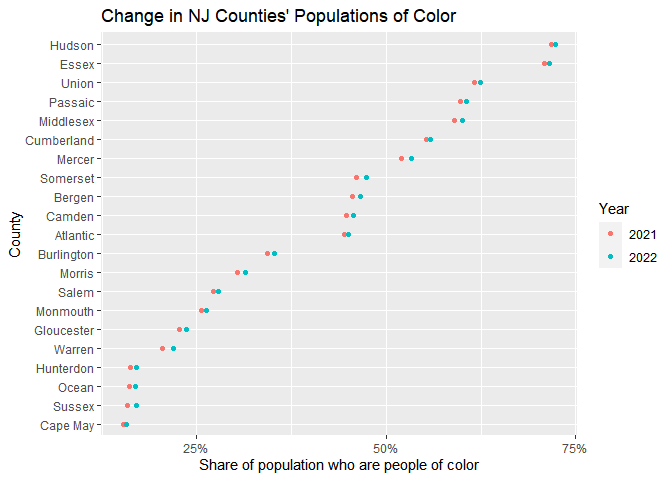

<!-- README.md is generated from README.Rmd. Please edit that file -->

# urbnindicators

<!-- badges: start -->

[](https://lifecycle.r-lib.org/articles/stages.html#experimental)
[](https://www.gnu.org/licenses/gpl-3.0)

<!-- badges: end -->

The goal of `urbnindicators` is to provide users with analysis-ready
data from the American Community Survey (ACS). Here’s what it offers as
compared to other solutions for working with ACS data:

- Meaningful, consistent variable names.

- Standardized variables, such as percentages, in addition to the raw
  count variables used to produce them.

- A codebook that describes how each variable is calculated.

- The built-in capacity to pull data for multiple years and multiple
  states.

- Supplemental measures, such as population density, that aren’t
  available from the ACS.

- Built-in quality checks to help ensure that calculated variables are
  accurate.

And there’s more in the works. Future updates will include:

- Even more indicators.

- Coefficients of variation for all variables to help measure estimate
  reliability.

- Checks for variable alignment over time.

- Support for inter-decadal geographic alignment.

## Installation

Install the development version of urbnindicators from
[GitHub](https://github.com/) with:

``` r
# install.packages("renv")
renv::install("UI-Research/urbnindicators")
#> - GitHub authentication credentials are not available.
#> - Please set GITHUB_PAT, or ensure the 'gitcreds' package is installed.
#> - See https://usethis.r-lib.org/articles/git-credentials.html for more details.
#> # Downloading packages -------------------------------------------------------
#> - Downloading urbnindicators from GitHub ...    OK [49 Mb in 2.2s]
#> Successfully downloaded 1 package in 5.4 seconds.
#> 
#> The following package(s) will be installed:
#> - urbnindicators [UI-Research/urbnindicators@main]
#> These packages will be installed into "~/Library/Caches/org.R-project.R/R/renv/library/urbnindicators-3c5e24d6/macos/R-4.4/aarch64-apple-darwin20".
#> 
#> # Installing packages --------------------------------------------------------
#> - Installing urbnindicators ...                 OK [built from source and cached in 1.6s]
#> Successfully installed 1 package in 1.7 seconds.
```

This package is under active development with frequent updates–check to
ensure you have the most recent version installed!

## urbnindicators in action

``` r
# library(dplyr)
# library(tidyr)
# library(stringr)
# library(urbnindicators)
# library(ggplot2)
# library(urbnthemes)

acs_df = compile_acs_data(
  variables = NULL,
  years = c(2017, 2022),
  geography = "county",
  states = "NJ",
  counties = NULL,
  spatial = FALSE) %>% 
  transmute(
    county_name = NAME %>% str_remove(" County, New Jersey"), 
    race_personofcolor_percent, 
    data_source_year)
#> 
#> 
#> Variable names and geographies for ACS data products can change between years.
#> Changes to geographies are particularly significant across decades
#> (e.g., from 2019 to 2020), but these changes can occur in any year.
#> 
#> Users should ensure that the logic embedded in this function--
#> which was developed around five-year ACS estimates for 2017-2021--
#> remains accurate for their use cases. Evaluation of measures and
#> geographies over time should be thoroughly quality checked.
#>   |                                                                              |                                                                      |   0%  |                                                                              |                                                                      |   1%  |                                                                              |=                                                                     |   1%  |                                                                              |=                                                                     |   2%  |                                                                              |==                                                                    |   2%  |                                                                              |==                                                                    |   3%  |                                                                              |==                                                                    |   4%  |                                                                              |===                                                                   |   5%  |                                                                              |====                                                                  |   6%  |                                                                              |=====                                                                 |   7%  |                                                                              |======                                                                |   8%  |                                                                              |======                                                                |   9%  |                                                                              |=======                                                               |  10%  |                                                                              |=======                                                               |  11%  |                                                                              |========                                                              |  11%  |                                                                              |========                                                              |  12%  |                                                                              |==========                                                            |  14%  |                                                                              |==========                                                            |  15%  |                                                                              |===========                                                           |  16%  |                                                                              |============                                                          |  16%  |                                                                              |============                                                          |  17%  |                                                                              |=============                                                         |  18%  |                                                                              |=============                                                         |  19%  |                                                                              |==============                                                        |  20%  |                                                                              |===============                                                       |  21%  |                                                                              |===============                                                       |  22%  |                                                                              |================                                                      |  22%  |                                                                              |================                                                      |  23%  |                                                                              |=================                                                     |  24%  |                                                                              |=================                                                     |  25%  |                                                                              |==================                                                    |  25%  |                                                                              |==================                                                    |  26%  |                                                                              |===================                                                   |  27%  |                                                                              |===================                                                   |  28%  |                                                                              |====================                                                  |  28%  |                                                                              |====================                                                  |  29%  |                                                                              |=====================                                                 |  30%  |                                                                              |=====================                                                 |  31%  |                                                                              |======================                                                |  31%  |                                                                              |======================                                                |  32%  |                                                                              |=======================                                               |  33%  |                                                                              |========================                                              |  34%  |                                                                              |========================                                              |  35%  |                                                                              |=========================                                             |  35%  |                                                                              |==========================                                            |  37%  |                                                                              |===========================                                           |  38%  |                                                                              |============================                                          |  40%  |                                                                              |=============================                                         |  41%  |                                                                              |=============================                                         |  42%  |                                                                              |==============================                                        |  42%  |                                                                              |==============================                                        |  43%  |                                                                              |===============================                                       |  44%  |                                                                              |===============================                                       |  45%  |                                                                              |================================                                      |  45%  |                                                                              |================================                                      |  46%  |                                                                              |=================================                                     |  46%  |                                                                              |=================================                                     |  47%  |                                                                              |=================================                                     |  48%  |                                                                              |==================================                                    |  48%  |                                                                              |==================================                                    |  49%  |                                                                              |===================================                                   |  49%  |                                                                              |===================================                                   |  50%  |                                                                              |=====================================                                 |  53%  |                                                                              |======================================                                |  54%  |                                                                              |=======================================                               |  55%  |                                                                              |=======================================                               |  56%  |                                                                              |========================================                              |  58%  |                                                                              |=========================================                             |  59%  |                                                                              |==========================================                            |  60%  |                                                                              |===========================================                           |  61%  |                                                                              |===========================================                           |  62%  |                                                                              |============================================                          |  62%  |                                                                              |============================================                          |  63%  |                                                                              |=============================================                         |  64%  |                                                                              |===============================================                       |  66%  |                                                                              |===============================================                       |  67%  |                                                                              |================================================                      |  68%  |                                                                              |================================================                      |  69%  |                                                                              |===================================================                   |  72%  |                                                                              |=====================================================                 |  76%  |                                                                              |============================================================          |  85%  |                                                                              |============================================================          |  86%  |                                                                              |=============================================================         |  87%  |                                                                              |=============================================================         |  88%  |                                                                              |==============================================================        |  89%  |                                                                              |===============================================================       |  89%  |                                                                              |===============================================================       |  90%  |                                                                              |===============================================================       |  91%  |                                                                              |================================================================      |  91%  |                                                                              |================================================================      |  92%  |                                                                              |=================================================================     |  93%  |                                                                              |==================================================================    |  94%  |                                                                              |===================================================================   |  95%  |                                                                              |===================================================================   |  96%  |                                                                              |====================================================================  |  97%  |                                                                              |====================================================================  |  98%  |                                                                              |===================================================================== |  98%  |                                                                              |===================================================================== |  99%  |                                                                              |======================================================================| 100%
#>   |                                                                              |                                                                      |   0%  |                                                                              |=                                                                     |   1%  |                                                                              |=                                                                     |   2%  |                                                                              |==                                                                    |   3%  |                                                                              |===                                                                   |   4%  |                                                                              |====                                                                  |   6%  |                                                                              |=====                                                                 |   7%  |                                                                              |=====                                                                 |   8%  |                                                                              |======                                                                |   8%  |                                                                              |======                                                                |   9%  |                                                                              |=======                                                               |  11%  |                                                                              |========                                                              |  11%  |                                                                              |========                                                              |  12%  |                                                                              |=========                                                             |  13%  |                                                                              |==========                                                            |  14%  |                                                                              |==========                                                            |  15%  |                                                                              |===========                                                           |  15%  |                                                                              |===========                                                           |  16%  |                                                                              |============                                                          |  17%  |                                                                              |============                                                          |  18%  |                                                                              |=============                                                         |  18%  |                                                                              |=============                                                         |  19%  |                                                                              |==============                                                        |  19%  |                                                                              |==============                                                        |  20%  |                                                                              |==============                                                        |  21%  |                                                                              |===============                                                       |  21%  |                                                                              |===============                                                       |  22%  |                                                                              |================                                                      |  22%  |                                                                              |================                                                      |  23%  |                                                                              |=================                                                     |  24%  |                                                                              |=================                                                     |  25%  |                                                                              |==================                                                    |  25%  |                                                                              |==================                                                    |  26%  |                                                                              |===================                                                   |  27%  |                                                                              |====================                                                  |  28%  |                                                                              |====================                                                  |  29%  |                                                                              |=====================                                                 |  29%  |                                                                              |=====================                                                 |  30%  |                                                                              |======================                                                |  31%  |                                                                              |======================                                                |  32%  |                                                                              |=======================                                               |  33%  |                                                                              |========================                                              |  34%  |                                                                              |=========================                                             |  35%  |                                                                              |=========================                                             |  36%  |                                                                              |==========================                                            |  36%  |                                                                              |==========================                                            |  37%  |                                                                              |==========================                                            |  38%  |                                                                              |===========================                                           |  38%  |                                                                              |===========================                                           |  39%  |                                                                              |============================                                          |  40%  |                                                                              |============================                                          |  41%  |                                                                              |=============================                                         |  41%  |                                                                              |=============================                                         |  42%  |                                                                              |==============================                                        |  42%  |                                                                              |==============================                                        |  43%  |                                                                              |===============================                                       |  44%  |                                                                              |===============================                                       |  45%  |                                                                              |================================                                      |  45%  |                                                                              |================================                                      |  46%  |                                                                              |=================================                                     |  47%  |                                                                              |==================================                                    |  49%  |                                                                              |===================================                                   |  49%  |                                                                              |===================================                                   |  50%  |                                                                              |====================================                                  |  51%  |                                                                              |====================================                                  |  52%  |                                                                              |=====================================                                 |  52%  |                                                                              |=====================================                                 |  53%  |                                                                              |=====================================                                 |  54%  |                                                                              |======================================                                |  54%  |                                                                              |======================================                                |  55%  |                                                                              |=======================================                               |  55%  |                                                                              |=======================================                               |  56%  |                                                                              |========================================                              |  57%  |                                                                              |========================================                              |  58%  |                                                                              |=========================================                             |  58%  |                                                                              |=========================================                             |  59%  |                                                                              |==========================================                            |  59%  |                                                                              |==========================================                            |  60%  |                                                                              |===========================================                           |  61%  |                                                                              |===========================================                           |  62%  |                                                                              |============================================                          |  63%  |                                                                              |=============================================                         |  64%  |                                                                              |=============================================                         |  65%  |                                                                              |==============================================                        |  65%  |                                                                              |==============================================                        |  66%  |                                                                              |===============================================                       |  66%  |                                                                              |===============================================                       |  67%  |                                                                              |===============================================                       |  68%  |                                                                              |================================================                      |  68%  |                                                                              |================================================                      |  69%  |                                                                              |=================================================                     |  70%  |                                                                              |====================================================                  |  74%  |                                                                              |====================================================                  |  75%  |                                                                              |=====================================================                 |  75%  |                                                                              |=====================================================                 |  76%  |                                                                              |======================================================                |  77%  |                                                                              |======================================================                |  78%  |                                                                              |=======================================================               |  78%  |                                                                              |=======================================================               |  79%  |                                                                              |========================================================              |  79%  |                                                                              |========================================================              |  80%  |                                                                              |=========================================================             |  81%  |                                                                              |=========================================================             |  82%  |                                                                              |==========================================================            |  83%  |                                                                              |==========================================================            |  84%  |                                                                              |===========================================================           |  84%  |                                                                              |===========================================================           |  85%  |                                                                              |============================================================          |  85%  |                                                                              |============================================================          |  86%  |                                                                              |=============================================================         |  87%  |                                                                              |==============================================================        |  88%  |                                                                              |==============================================================        |  89%  |                                                                              |===============================================================       |  90%  |                                                                              |================================================================      |  91%  |                                                                              |================================================================      |  92%  |                                                                              |=================================================================     |  92%  |                                                                              |=================================================================     |  93%  |                                                                              |==================================================================    |  94%  |                                                                              |==================================================================    |  95%  |                                                                              |===================================================================   |  95%  |                                                                              |===================================================================   |  96%  |                                                                              |======================================================================| 100%
#> Getting data from the 2013-2017 5-year ACS
#> Getting data from the 2018-2022 5-year ACS

state_averages = acs_df %>%
  group_by(data_source_year) %>%
  summarize(mean_race_personofcolor_percent = mean(race_personofcolor_percent)) %>%
  arrange(data_source_year) %>%
  pull()

dumbbell_data = acs_df %>% 
  pivot_wider(
    names_from = data_source_year, 
    values_from = race_personofcolor_percent, 
    names_prefix = "year_")

acs_df %>% 
  ggplot() +
    geom_segment(
      data = dumbbell_data,
      aes(
        x = reorder(county_name, year_2017),
        y = year_2017,
        yend = year_2022),
      color = palette_urbn_main[7],
      linewidth = 1) +
    geom_point(
      aes(
      x = reorder(county_name, race_personofcolor_percent), 
      y = race_personofcolor_percent, 
      color = factor(data_source_year))) +
    annotate(
      "text", 
      y = .31,  
      x = 21.5, 
      label = "State mean (2017)", 
      fontface = "bold.italic", 
      color = palette_urbn_main[1]) +
    annotate(
      "text", 
      y = .47,  
      x = 21.5, 
      label = "State mean (2022)", 
      fontface = "bold.italic", 
      color = palette_urbn_main[2]) +
    geom_hline(yintercept = state_averages[1], linetype = "dashed", color = palette_urbn_main[1]) +
    geom_hline(yintercept = state_averages[2], linetype = "dashed", color = palette_urbn_main[2]) +
    labs(
      title = "Change in NJ Counties' Racial Composition, 2017 to 2022",
      subtitle = paste0(
        "On average, counties in NJ saw a ", 
        round((state_averages[2] - state_averages[1]), digits = 3) * 100, 
        " pecentage point increase in the share of the population who are people of color from 2017 to 2022.") %>%
        str_wrap(120), 
      x = "County", 
      y = "Share of population who are people of color",
      color = "Year") +
    scale_x_discrete(expand = expansion(mult = c(.03, 0.04))) +
    scale_y_continuous(
      breaks = c(0, .25, .50, .75, 1.0),
      limits = c(0, .75),
      labels = scales::percent) +
    coord_flip()
```


