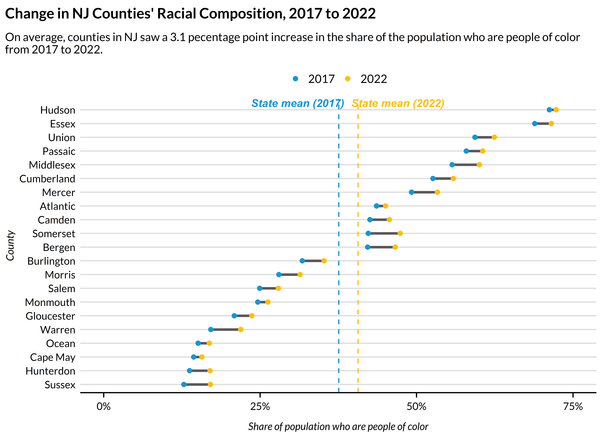

<!-- README.md is generated from README.Rmd. Please edit that file -->

# urbnindicators

<!-- badges: start -->

[](https://lifecycle.r-lib.org/articles/stages.html#experimental)
[](https://www.gnu.org/licenses/gpl-3.0)

<!-- badges: end -->

# Overview

**urbnindicators** aims to provide users with analysis-ready data from
the American Community Survey (ACS).

With a single function call, you get:

- Hundreds of standardized variables, such as percentages, in addition
  to the raw count variables used to produce them.

- Meaningful, consistent variable names.

- A codebook that describes how each variable is calculated.

- The built-in capacity to pull data for multiple years and multiple
  states.

- Supplemental measures, such as population density, that aren’t
  available from the ACS.

- Built-in quality checks to help ensure that calculated variables are
  accurate.

- Margins of error and coefficients of variation for (virtually) all
  variables.

# Installation

Install the development version of `urbnindicators` from
[GitHub](https://github.com/) with:

    install.packages("renv")
    renv::install("UI-Research/urbnindicators")

Note that this package is under active development with frequent
updates–check to ensure you have the most recent version installed!

# Use

## Obtain data

``` r
plot_data = compile_acs_data(
    years = c(2017, 2022),
    geography = "county",
    states = "NJ",
    counties = NULL,
    spatial = FALSE)  %>% 
  transmute(
    county_name = NAME %>% str_remove(" County, New Jersey"), 
    race_personofcolor_percent, 
    data_source_year)
#>   |                                                                              |                                                                      |   0%  |                                                                              |                                                                      |   1%  |                                                                              |=                                                                     |   2%  |                                                                              |==                                                                    |   3%  |                                                                              |===                                                                   |   4%  |                                                                              |===                                                                   |   5%  |                                                                              |====                                                                  |   5%  |                                                                              |====                                                                  |   6%  |                                                                              |=====                                                                 |   7%  |                                                                              |=====                                                                 |   8%  |                                                                              |======                                                                |   8%  |                                                                              |======                                                                |   9%  |                                                                              |=======                                                               |  10%  |                                                                              |========                                                              |  11%  |                                                                              |========                                                              |  12%  |                                                                              |=========                                                             |  12%  |                                                                              |=========                                                             |  13%  |                                                                              |==========                                                            |  14%  |                                                                              |==========                                                            |  15%  |                                                                              |===========                                                           |  15%  |                                                                              |===========                                                           |  16%  |                                                                              |============                                                          |  17%  |                                                                              |============                                                          |  18%  |                                                                              |=============                                                         |  18%  |                                                                              |=============                                                         |  19%  |                                                                              |==============                                                        |  19%  |                                                                              |==============                                                        |  20%  |                                                                              |==============                                                        |  21%  |                                                                              |===============                                                       |  21%  |                                                                              |===============                                                       |  22%  |                                                                              |================                                                      |  22%  |                                                                              |================                                                      |  23%  |                                                                              |=================                                                     |  24%  |                                                                              |=================                                                     |  25%  |                                                                              |==================                                                    |  25%  |                                                                              |==================                                                    |  26%  |                                                                              |===================                                                   |  27%  |                                                                              |===================                                                   |  28%  |                                                                              |====================                                                  |  28%  |                                                                              |====================                                                  |  29%  |                                                                              |=====================                                                 |  29%  |                                                                              |=====================                                                 |  30%  |                                                                              |======================                                                |  31%  |                                                                              |======================                                                |  32%  |                                                                              |=======================                                               |  32%  |                                                                              |=======================                                               |  33%  |                                                                              |========================                                              |  34%  |                                                                              |========================                                              |  35%  |                                                                              |=========================                                             |  35%  |                                                                              |=========================                                             |  36%  |                                                                              |==========================                                            |  37%  |                                                                              |==========================                                            |  38%  |                                                                              |===========================                                           |  38%  |                                                                              |===========================                                           |  39%  |                                                                              |============================                                          |  41%  |                                                                              |=============================                                         |  41%  |                                                                              |=============================                                         |  42%  |                                                                              |==============================                                        |  43%  |                                                                              |==============================                                        |  44%  |                                                                              |===============================                                       |  44%  |                                                                              |===============================                                       |  45%  |                                                                              |================================                                      |  45%  |                                                                              |================================                                      |  46%  |                                                                              |=================================                                     |  47%  |                                                                              |=================================                                     |  48%  |                                                                              |==================================                                    |  48%  |                                                                              |==================================                                    |  49%  |                                                                              |===================================                                   |  50%  |                                                                              |===================================                                   |  51%  |                                                                              |====================================                                  |  51%  |                                                                              |====================================                                  |  52%  |                                                                              |=====================================                                 |  53%  |                                                                              |=====================================                                 |  54%  |                                                                              |======================================                                |  54%  |                                                                              |======================================                                |  55%  |                                                                              |=======================================                               |  56%  |                                                                              |========================================                              |  57%  |                                                                              |========================================                              |  58%  |                                                                              |=========================================                             |  59%  |                                                                              |==========================================                            |  59%  |                                                                              |==========================================                            |  60%  |                                                                              |==========================================                            |  61%  |                                                                              |===========================================                           |  61%  |                                                                              |===========================================                           |  62%  |                                                                              |=============================================                         |  65%  |                                                                              |==============================================                        |  66%  |                                                                              |===============================================                       |  66%  |                                                                              |===============================================                       |  67%  |                                                                              |===============================================                       |  68%  |                                                                              |================================================                      |  68%  |                                                                              |================================================                      |  69%  |                                                                              |=================================================                     |  70%  |                                                                              |==================================================                    |  71%  |                                                                              |===================================================                   |  72%  |                                                                              |===================================================                   |  73%  |                                                                              |====================================================                  |  74%  |                                                                              |====================================================                  |  75%  |                                                                              |=====================================================                 |  75%  |                                                                              |=====================================================                 |  76%  |                                                                              |======================================================                |  77%  |                                                                              |=======================================================               |  78%  |                                                                              |=======================================================               |  79%  |                                                                              |========================================================              |  79%  |                                                                              |========================================================              |  80%  |                                                                              |========================================================              |  81%  |                                                                              |=========================================================             |  81%  |                                                                              |=========================================================             |  82%  |                                                                              |==========================================================            |  82%  |                                                                              |==========================================================            |  83%  |                                                                              |===========================================================           |  84%  |                                                                              |===========================================================           |  85%  |                                                                              |============================================================          |  85%  |                                                                              |============================================================          |  86%  |                                                                              |=============================================================         |  86%  |                                                                              |=============================================================         |  87%  |                                                                              |=============================================================         |  88%  |                                                                              |==============================================================        |  88%  |                                                                              |==============================================================        |  89%  |                                                                              |===============================================================       |  89%  |                                                                              |===============================================================       |  90%  |                                                                              |===============================================================       |  91%  |                                                                              |================================================================      |  91%  |                                                                              |================================================================      |  92%  |                                                                              |=================================================================     |  93%  |                                                                              |=================================================================     |  94%  |                                                                              |==================================================================    |  95%  |                                                                              |===================================================================   |  96%  |                                                                              |====================================================================  |  97%  |                                                                              |====================================================================  |  98%  |                                                                              |===================================================================== |  99%  |                                                                              |======================================================================| 100%
#> Downloading: 48 kB     Downloading: 48 kB     Downloading: 65 kB     Downloading: 65 kB     Downloading: 160 kB     Downloading: 160 kB     Downloading: 240 kB     Downloading: 240 kB     Downloading: 290 kB     Downloading: 290 kB     Downloading: 340 kB     Downloading: 340 kB     Downloading: 390 kB     Downloading: 390 kB     Downloading: 420 kB     Downloading: 420 kB     Downloading: 490 kB     Downloading: 490 kB     Downloading: 550 kB     Downloading: 550 kB     Downloading: 620 kB     Downloading: 620 kB     Downloading: 690 kB     Downloading: 690 kB     Downloading: 720 kB     Downloading: 720 kB     Downloading: 720 kB     Downloading: 720 kB     Downloading: 750 kB     Downloading: 750 kB     Downloading: 780 kB     Downloading: 780 kB     Downloading: 800 kB     Downloading: 800 kB     Downloading: 850 kB     Downloading: 850 kB     Downloading: 850 kB     Downloading: 850 kB     Downloading: 930 kB     Downloading: 930 kB     Downloading: 980 kB     Downloading: 980 kB     Downloading: 1 MB     Downloading: 1 MB     Downloading: 1.1 MB     Downloading: 1.1 MB     Downloading: 1.2 MB     Downloading: 1.2 MB     Downloading: 1.2 MB     Downloading: 1.2 MB     Downloading: 1.3 MB     Downloading: 1.3 MB     Downloading: 1.3 MB     Downloading: 1.3 MB     Downloading: 1.4 MB     Downloading: 1.4 MB     Downloading: 1.5 MB     Downloading: 1.5 MB     Downloading: 1.6 MB     Downloading: 1.6 MB     Downloading: 1.6 MB     Downloading: 1.6 MB     Downloading: 1.6 MB     Downloading: 1.6 MB     Downloading: 1.7 MB     Downloading: 1.7 MB     Downloading: 1.8 MB     Downloading: 1.8 MB     Downloading: 1.8 MB     Downloading: 1.8 MB     Downloading: 1.8 MB     Downloading: 1.8 MB     Downloading: 1.8 MB     Downloading: 1.8 MB     Downloading: 1.9 MB     Downloading: 1.9 MB     Downloading: 1.9 MB     Downloading: 1.9 MB     Downloading: 1.9 MB     Downloading: 1.9 MB     Downloading: 2 MB     Downloading: 2 MB     Downloading: 2 MB     Downloading: 2 MB     Downloading: 2.1 MB     Downloading: 2.1 MB     Downloading: 2.1 MB     Downloading: 2.1 MB     Downloading: 2.1 MB     Downloading: 2.1 MB     Downloading: 2.2 MB     Downloading: 2.2 MB     Downloading: 2.2 MB     Downloading: 2.2 MB     Downloading: 2.2 MB     Downloading: 2.2 MB     Downloading: 2.2 MB     Downloading: 2.2 MB     Downloading: 2.3 MB     Downloading: 2.3 MB     Downloading: 2.3 MB     Downloading: 2.3 MB     Downloading: 2.3 MB     Downloading: 2.3 MB     Downloading: 2.4 MB     Downloading: 2.4 MB     Downloading: 2.4 MB     Downloading: 2.4 MB     Downloading: 2.4 MB     Downloading: 2.4 MB     Downloading: 2.5 MB     Downloading: 2.5 MB     Downloading: 2.5 MB     Downloading: 2.5 MB     Downloading: 2.6 MB     Downloading: 2.6 MB     Downloading: 2.6 MB     Downloading: 2.6 MB     Downloading: 2.6 MB     Downloading: 2.6 MB     Downloading: 2.6 MB     Downloading: 2.6 MB     Downloading: 2.7 MB     Downloading: 2.7 MB     Downloading: 2.7 MB     Downloading: 2.7 MB     Downloading: 2.7 MB     Downloading: 2.7 MB     Downloading: 2.7 MB     Downloading: 2.7 MB     Downloading: 2.7 MB     Downloading: 2.7 MB     Downloading: 2.8 MB     Downloading: 2.8 MB     Downloading: 2.8 MB     Downloading: 2.8 MB     Downloading: 2.9 MB     Downloading: 2.9 MB     Downloading: 2.9 MB     Downloading: 2.9 MB     Downloading: 2.9 MB     Downloading: 2.9 MB     Downloading: 2.9 MB     Downloading: 2.9 MB     Downloading: 3 MB     Downloading: 3 MB     Downloading: 3 MB     Downloading: 3 MB     Downloading: 3 MB     Downloading: 3 MB     Downloading: 3 MB     Downloading: 3 MB     Downloading: 3.1 MB     Downloading: 3.1 MB     Downloading: 3.1 MB     Downloading: 3.1 MB     Downloading: 3.1 MB     Downloading: 3.1 MB     Downloading: 3.2 MB     Downloading: 3.2 MB     Downloading: 3.2 MB     Downloading: 3.2 MB     Downloading: 3.2 MB     Downloading: 3.2 MB     Downloading: 3.3 MB     Downloading: 3.3 MB     Downloading: 3.3 MB     Downloading: 3.3 MB     Downloading: 3.4 MB     Downloading: 3.4 MB     Downloading: 3.4 MB     Downloading: 3.4 MB     Downloading: 3.5 MB     Downloading: 3.5 MB     Downloading: 3.5 MB     Downloading: 3.5 MB     Downloading: 3.5 MB     Downloading: 3.5 MB     Downloading: 3.6 MB     Downloading: 3.6 MB     Downloading: 3.6 MB     Downloading: 3.6 MB     Downloading: 3.6 MB     Downloading: 3.6 MB     Downloading: 3.7 MB     Downloading: 3.7 MB     Downloading: 3.7 MB     Downloading: 3.7 MB     Downloading: 3.7 MB     Downloading: 3.7 MB     Downloading: 3.7 MB     Downloading: 3.7 MB     Downloading: 3.7 MB     Downloading: 3.7 MB     Downloading: 3.8 MB     Downloading: 3.8 MB     Downloading: 3.8 MB     Downloading: 3.8 MB     Downloading: 3.8 MB     Downloading: 3.8 MB     Downloading: 3.8 MB     Downloading: 3.8 MB     Downloading: 3.8 MB     Downloading: 3.8 MB     Downloading: 3.9 MB     Downloading: 3.9 MB     Downloading: 3.9 MB     Downloading: 3.9 MB     Downloading: 4 MB     Downloading: 4 MB     Downloading: 4 MB     Downloading: 4 MB     Downloading: 4.1 MB     Downloading: 4.1 MB     Downloading: 4.1 MB     Downloading: 4.1 MB     Downloading: 4.2 MB     Downloading: 4.2 MB     Downloading: 4.3 MB     Downloading: 4.3 MB     Downloading: 4.3 MB     Downloading: 4.3 MB     Downloading: 4.3 MB     Downloading: 4.3 MB     Downloading: 4.4 MB     Downloading: 4.4 MB     Downloading: 4.4 MB     Downloading: 4.4 MB     Downloading: 4.5 MB     Downloading: 4.5 MB     Downloading: 4.5 MB     Downloading: 4.5 MB     Downloading: 4.6 MB     Downloading: 4.6 MB     Downloading: 4.6 MB     Downloading: 4.6 MB     Downloading: 4.6 MB     Downloading: 4.6 MB     Downloading: 4.7 MB     Downloading: 4.7 MB     Downloading: 4.7 MB     Downloading: 4.7 MB     Downloading: 4.7 MB     Downloading: 4.7 MB     Downloading: 4.7 MB     Downloading: 4.7 MB     Downloading: 4.7 MB     Downloading: 4.7 MB     Downloading: 4.8 MB     Downloading: 4.8 MB     Downloading: 4.8 MB     Downloading: 4.8 MB     Downloading: 4.9 MB     Downloading: 4.9 MB     Downloading: 4.9 MB     Downloading: 4.9 MB     Downloading: 4.9 MB     Downloading: 4.9 MB     Downloading: 5 MB     Downloading: 5 MB     Downloading: 5 MB     Downloading: 5 MB     Downloading: 5.1 MB     Downloading: 5.1 MB     Downloading: 5.1 MB     Downloading: 5.1 MB     Downloading: 5.1 MB     Downloading: 5.1 MB     Downloading: 5.1 MB     Downloading: 5.1 MB     Downloading: 5.1 MB     Downloading: 5.1 MB     Downloading: 5.2 MB     Downloading: 5.2 MB     Downloading: 5.2 MB     Downloading: 5.2 MB     Downloading: 5.3 MB     Downloading: 5.3 MB     Downloading: 5.4 MB     Downloading: 5.4 MB     Downloading: 5.4 MB     Downloading: 5.4 MB     Downloading: 5.5 MB     Downloading: 5.5 MB     Downloading: 5.6 MB     Downloading: 5.6 MB     Downloading: 5.6 MB     Downloading: 5.6 MB     Downloading: 5.7 MB     Downloading: 5.7 MB     Downloading: 5.8 MB     Downloading: 5.8 MB     Downloading: 5.9 MB     Downloading: 5.9 MB     Downloading: 5.9 MB     Downloading: 5.9 MB     Downloading: 5.9 MB     Downloading: 5.9 MB     Downloading: 6 MB     Downloading: 6 MB     Downloading: 6 MB     Downloading: 6 MB     Downloading: 6 MB     Downloading: 6 MB     Downloading: 6.1 MB     Downloading: 6.1 MB     Downloading: 6.2 MB     Downloading: 6.2 MB     Downloading: 6.2 MB     Downloading: 6.2 MB     Downloading: 6.2 MB     Downloading: 6.2 MB     Downloading: 6.2 MB     Downloading: 6.2 MB     Downloading: 6.3 MB     Downloading: 6.3 MB     Downloading: 6.3 MB     Downloading: 6.3 MB     Downloading: 6.3 MB     Downloading: 6.3 MB     Downloading: 6.4 MB     Downloading: 6.4 MB     Downloading: 6.4 MB     Downloading: 6.4 MB     Downloading: 6.4 MB     Downloading: 6.4 MB     Downloading: 6.4 MB     Downloading: 6.4 MB     Downloading: 6.5 MB     Downloading: 6.5 MB     Downloading: 6.5 MB     Downloading: 6.5 MB     Downloading: 6.5 MB     Downloading: 6.5 MB     Downloading: 6.6 MB     Downloading: 6.6 MB     Downloading: 6.6 MB     Downloading: 6.6 MB     Downloading: 6.7 MB     Downloading: 6.7 MB     Downloading: 6.7 MB     Downloading: 6.7 MB     Downloading: 6.8 MB     Downloading: 6.8 MB     Downloading: 6.9 MB     Downloading: 6.9 MB     Downloading: 6.9 MB     Downloading: 6.9 MB     Downloading: 6.9 MB     Downloading: 6.9 MB     Downloading: 7 MB     Downloading: 7 MB     Downloading: 7 MB     Downloading: 7 MB     Downloading: 7 MB     Downloading: 7 MB     Downloading: 7.1 MB     Downloading: 7.1 MB     Downloading: 7.1 MB     Downloading: 7.1 MB     Downloading: 7.1 MB     Downloading: 7.1 MB     Downloading: 7.2 MB     Downloading: 7.2 MB     Downloading: 7.2 MB     Downloading: 7.2 MB     Downloading: 7.2 MB     Downloading: 7.2 MB     Downloading: 7.3 MB     Downloading: 7.3 MB     Downloading: 7.3 MB     Downloading: 7.3 MB     Downloading: 7.3 MB     Downloading: 7.3 MB     Downloading: 7.4 MB     Downloading: 7.4 MB     Downloading: 7.5 MB     Downloading: 7.5 MB     Downloading: 7.6 MB     Downloading: 7.6 MB     Downloading: 7.6 MB     Downloading: 7.6 MB     Downloading: 7.7 MB     Downloading: 7.7 MB     Downloading: 7.7 MB     Downloading: 7.7 MB     Downloading: 7.7 MB     Downloading: 7.7 MB     Downloading: 7.8 MB     Downloading: 7.8 MB     Downloading: 7.8 MB     Downloading: 7.8 MB     Downloading: 8.3 MB     Downloading: 8.3 MB     Downloading: 8.6 MB     Downloading: 8.6 MB     Downloading: 9.3 MB     Downloading: 9.3 MB     Downloading: 9.4 MB     Downloading: 9.4 MB     Downloading: 9.5 MB     Downloading: 9.5 MB     Downloading: 9.5 MB     Downloading: 9.5 MB     Downloading: 9.6 MB     Downloading: 9.6 MB     Downloading: 9.7 MB     Downloading: 9.7 MB     Downloading: 9.7 MB     Downloading: 9.7 MB     Downloading: 9.7 MB     Downloading: 9.7 MB     Downloading: 9.8 MB     Downloading: 9.8 MB     Downloading: 9.9 MB     Downloading: 9.9 MB     Downloading: 10 MB     Downloading: 10 MB     Downloading: 10 MB     Downloading: 10 MB     Downloading: 11 MB     Downloading: 11 MB     Downloading: 11 MB     Downloading: 11 MB     Downloading: 11 MB     Downloading: 11 MB     Downloading: 11 MB     Downloading: 11 MB     Downloading: 11 MB     Downloading: 11 MB     Downloading: 11 MB     Downloading: 11 MB     Downloading: 11 MB     Downloading: 11 MB     Downloading: 12 MB     Downloading: 12 MB     Downloading: 12 MB     Downloading: 12 MB     Downloading: 12 MB     Downloading: 12 MB     Downloading: 12 MB     Downloading: 12 MB     Downloading: 12 MB     Downloading: 12 MB

state_averages = plot_data %>%
  group_by(data_source_year) %>%
  summarize(mean_race_personofcolor_percent = mean(race_personofcolor_percent)) %>%
  arrange(data_source_year) %>%
  pull()

dumbbell_data = plot_data %>% 
  pivot_wider(
    names_from = data_source_year, 
    values_from = race_personofcolor_percent, 
    names_prefix = "year_")
```

## Plot data

``` r
ggplot() +
  geom_segment(
    data = dumbbell_data,
    aes(
      x = reorder(county_name, year_2017),
      y = year_2017,
      yend = year_2022),
    color = palette_urbn_main[7],
    linewidth = 1) +
  geom_point(
    data = plot_data, 
    aes(
      x = reorder(county_name, race_personofcolor_percent), 
      y = race_personofcolor_percent, 
      color = factor(data_source_year))) +
  annotate(
    "text", 
    y = .31,  
    x = 21.5, 
    label = "State mean (2017)", 
    fontface = "bold.italic", 
    color = palette_urbn_main[1]) +
  annotate(
    "text", 
    y = .47,  
    x = 21.5, 
    label = "State mean (2022)", 
    fontface = "bold.italic", 
    color = palette_urbn_main[2]) +
  geom_hline(
    yintercept = state_averages[1], 
    linetype = "dashed", 
    color = palette_urbn_main[1]) +
  geom_hline(
    yintercept = state_averages[2], 
    linetype = "dashed", 
    color = palette_urbn_main[2]) +
  labs(
    title = "Change in NJ Counties' Racial Composition, 2017 to 2022",
    subtitle = paste0(
      "On average, counties in NJ saw a ", 
      round((state_averages[2] - state_averages[1]), digits = 3) * 100, 
      " pecentage point increase in the share of the population who are people of color from 2017 to 2022.") %>%
      str_wrap(120), 
    x = "County", 
    y = "Share of population who are people of color",
    color = "Year") +
  scale_x_discrete(expand = expansion(mult = c(.03, 0.04))) +
  scale_y_continuous(
    breaks = c(0, .25, .50, .75, 1.0),
    limits = c(0, .75),
    labels = scales::percent) +
  coord_flip()
```



# Learn More

A growing number of vignettes aim to support users in effectively using
this package. These vignettes include:

- A package overview to help users [**Get
  Started**](urbnindicators.html).

- An interactive version of the package’s
  [**Codebook**](codebook.html)so that prospective users can know what
  to expect.

- A brief description of the package’s [**Design
  Philosophy**](design-philosophy.html)to clarify the use-cases that
  `urbnindicators` is built to support.

- An illustration of how [Quantified Survey
  Error](quantified-survey-error.html) can improve inference making.

# Credits

This package is built on top of and enormously indebted to
`library(tidycensus)`, which provides the core functionality for
accessing the Census Bureau API. For users who want additional
variables, `library(tidycensus)` exposes the entire range of
pre-tabulated variables available from the ACS and provides access to
ACS microdata and other Census Bureau datasets. Learn more here:
<https://walker-data.com/tidycensus/index.html>.
