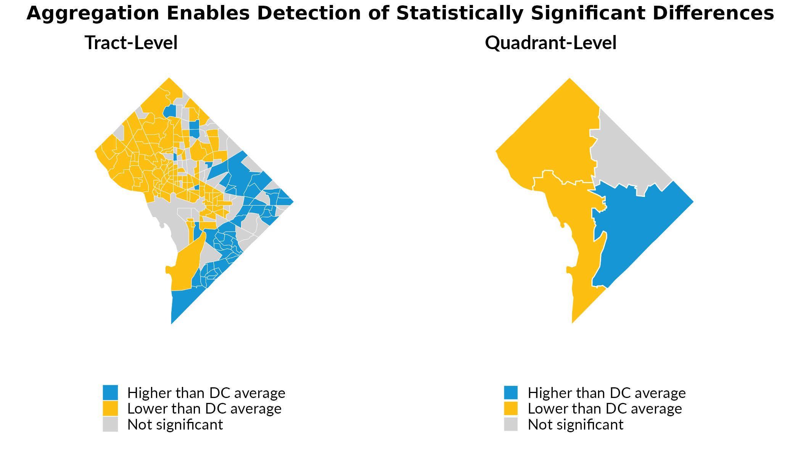

# Aggregating to Custom Geographies

Census tracts are useful geographic units, but their small populations
often produce estimates with large margins of error. When analyzing
data, these imprecise estimates make it difficult to detect meaningful
differences between areas—even when real differences exist.

[`calculate_custom_geographies()`](https://ui-research.github.io/urbnindicators/reference/calculate_custom_geographies.md)
addresses this by aggregating tract-level (or really any level of data)
data to user-defined geographies (e.g., neighborhoods, planning
districts, or school zones). This aggregation increases sample sizes,
reduces coefficients of variation, and enables more reliable statistical
inference.

## Example: DC Quadrants

We’ll demonstrate using tract-level data for Washington, DC, comparing
the share of population receiving SNAP benefits across areas
“quadrants”.

``` r
dc_tracts = compile_acs_data(
  years = 2024,
  tables = "snap",
  geography = "tract",
  states = "DC",
  spatial = TRUE)
```

## Creating Custom Geographies

For illustration, we’ll create four quadrants of DC by grouping tracts
based on their centroid coordinates. In practice, you would join tracts
to meaningful boundaries like neighborhoods or planning areas, or you
could group arbitrary numbers of adjacent tracts to form
pseudo-neighborhoods with larger populations than are captured in any
single tract.

``` r
# Calculate tract centroids and assign to quadrants
dc_tracts = dc_tracts %>%
  mutate(
    centroid = st_centroid(geometry),
    longitude = st_coordinates(centroid)[, 1],
    latitude = st_coordinates(centroid)[, 2],
    quadrant = case_when(
      longitude < median(longitude) & latitude >= median(latitude) ~ "Northwest",
      longitude >= median(longitude) & latitude >= median(latitude) ~ "Northeast",
      longitude < median(longitude) & latitude < median(latitude) ~ "Southwest",
      longitude >= median(longitude) & latitude < median(latitude) ~ "Southeast")) %>%
  select(-centroid, -longitude, -latitude)

# Aggregate to quadrants
dc_quadrants = calculate_custom_geographies(
  .data = dc_tracts,
  group_id = "quadrant",
  spatial = TRUE)
```

## Comparing Precision

The maps below show the share of households receiving SNAP benefits.
Notice how aggregating to quadrants produces more precise estimates with
smaller margins of error. Indeed, the median coefficient of variation
(derived from the MOE) for tract level is greater than 30, a common
upper bound for “reliable” estimates.

``` r
  bind_rows(
    dc_tracts %>% mutate(geography = "Tract"),
    dc_quadrants %>% mutate(geography = "Quadrant")) %>%
  mutate(
    .by = geography,
    cv = (snap_received_percent_M / 1.645) / snap_received_percent * 100,
    cv = if_else(is.infinite(cv), NA_real_, cv),
    median_cv = round(median(cv, na.rm = TRUE)),
    label = str_c(geography, " - median CV: ", median_cv)) %>%
  ggplot() +
    geom_sf(aes(fill = snap_received_percent), color = "white", linewidth = 0.1) +
    scale_fill_continuous(palette = palette_urbn_cyan[c(3, 5, 7)], labels = scales::percent) +
    theme_urbn_map() +
    labs(fill = "SNAP Receipt (%)") +
    facet_wrap(~ label)
```


The quadrant-level estimates have substantially lower margins of error,
indicating more reliable estimates.

## Detecting Statistically Significant Differences

By aggregating our tract observations, we can also calculate
statistically significant differences at greater geographic scales. This
enables analysis for more policy-relevant areas and helps mitigate
shortcomings associated with high measures of error for
smaller-population observations, which can lead to findings of no
statistically significant differences.

``` r
# Calculate DC-wide SNAP rate for comparison
dc_snap_rate = sum(dc_tracts$snap_received, na.rm = TRUE) /
               sum(dc_tracts$snap_universe, na.rm = TRUE)

# Test significance at tract level
tracts_sig = dc_tracts %>%
  mutate(
    significant = tidycensus::significance(
      est1 = snap_received_percent,
      est2 = dc_snap_rate,
      moe1 = snap_received_percent_M,
      moe2 = 0.005,
      clevel = 0.9),
    difference = case_when(
      !significant ~ "Not significant",
      snap_received_percent > dc_snap_rate ~ "Higher than DC average",
      snap_received_percent < dc_snap_rate ~ "Lower than DC average"))

# Test significance at quadrant level
quadrants_sig = dc_quadrants %>%
  mutate(
    significant = tidycensus::significance(
      est1 = snap_received_percent,
      est2 = dc_snap_rate,
      moe1 = snap_received_percent_M,
      moe2 = 0.005,
      clevel = 0.9),
    difference = case_when(
      !significant ~ "Not significant",
      snap_received_percent > dc_snap_rate ~ "Higher than DC average",
      snap_received_percent < dc_snap_rate ~ "Lower than DC average"))

# Color palette
sig_colors = c(
  "Higher than DC average" = "#1696D2",
  "Lower than DC average" = "#FDBF11",
  "Not significant" = "#D2D2D2")

# Maps
map_tracts_sig = tracts_sig %>%
  ggplot() +
  geom_sf(aes(fill = difference), color = "white", linewidth = 0.1) +
  scale_fill_manual(values = sig_colors, na.value = "grey80") +
  urbnthemes::theme_urbn_map() +
  theme(legend.position = "bottom") +
  labs(fill = "", subtitle = "Tract-level", title = "")

map_quadrants_sig = quadrants_sig %>%
  ggplot() +
  geom_sf(aes(fill = difference), color = "white", linewidth = 0.3) +
  scale_fill_manual(values = sig_colors, na.value = "grey80") +
  urbnthemes::theme_urbn_map() +
  theme(legend.position = "bottom") +
  labs(fill = "", subtitle = "Quadrant-level", title = "")

gridExtra::grid.arrange(
  map_tracts_sig, map_quadrants_sig,
  ncol = 2,
  top = grid::textGrob(
    "Aggregation can mitigate challenges with small-population, high-error observations",
    gp = grid::gpar(fontsize = 12, fontface = "bold")))
```



## Key Takeaways

1.  **Aggregation improves precision**: Combining tracts into larger
    geographies reduces CVs and margins of error.

2.  **Better inference**: More precise estimates enable detection of
    statistically significant differences that would otherwise be
    obscured by sampling error.

3.  **More relevant units of analysis**: The ACS reports estimates at
    many geographies, but there are many others that are not supported.
    Think neighborhoods, wards, continuums of care, school districts,
    and more. To robustly calculate errors and draw reliable inferences
    for these other geographies is critical but challenging.
