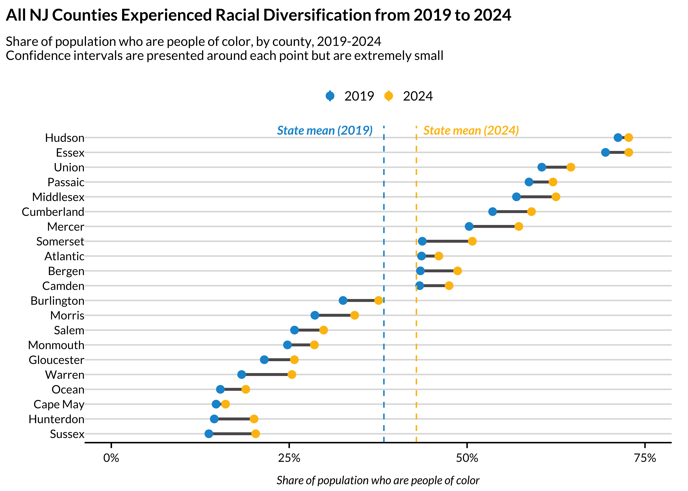

# urbnindicators

# Overview

**urbnindicators** aims to provide users with analysis-ready data from
the American Community Survey (ACS).

What you can access:

- Hundreds of pre-computed variables, including percentages and the raw
  count variables used to produce them. Or flexibly query any table your
  heart desires.

- Or flexibly specify your own derived variables with a series of helper
  functions.

- Margins of error for all variables–those direct from the API as well
  as derived variables–with correctly calculated pooled margins of
  error, per Census Bureau guidance.

- Meaningful, consistent variable names–no more “B01003_001”; try
  “total_population_universe” instead. (But if you’re fond of the API’s
  variable names, those are stored in the codebook as well for
  cross-referencing.)

- A codebook that describes how each variable is calculated.

- Data for multiple years and multiple states out of the box.

- Supplemental measures, such as population density, that aren’t
  available from the ACS.

- Tools to aggregate or interpolate your data to different
  geographies–along with correctly adjusted margins of error.

# Installation

Install the development version of `urbnindicators` from
[GitHub](https://github.com/) with:

``` r
# install.packages("renv")
renv::install("UI-Research/urbnindicators")
```

You’ll want a Census API key ([request one
here](https://api.census.gov/data/key_signup.html)). Set it once with:

``` r
tidycensus::census_api_key("YOUR_KEY", install = TRUE)
```

Note that this package is under active development with frequent
updates–check to ensure you have the most recent version installed!

# Use

## Discover Available Data

``` r
list_tables() |> head(10)
#>  [1] "age"                    "computing_devices"      "cost_burden"           
#>  [4] "disability"             "educational_attainment" "employment"            
#>  [7] "gini"                   "health_insurance"       "household_size"        
#> [10] "income_quintiles"
```

## Obtain Data

A single call to
[`compile_acs_data()`](https://ui-research.github.io/urbnindicators/reference/compile_acs_data.md)
returns analysis-ready data with pre-computed percentages, meaningful
variable names, and margins of error:

``` r
df = compile_acs_data(
  tables = "race",
  years = c(2019, 2024),
  geography = "county",
  states = "NJ")

df %>%
  select(1:10) %>%
  glimpse()
#> Rows: 42
#> Columns: 10
#> $ data_source_year             <dbl> 2019, 2019, 2019, 2019, 2019, 2019, 2019,…
#> $ GEOID                        <chr> "34025", "34037", "34013", "34015", "3403…
#> $ NAME                         <chr> "Monmouth County, New Jersey", "Sussex Co…
#> $ total_population_universe    <dbl> 621659, 141483, 795404, 291165, 503637, 9…
#> $ race_universe                <dbl> 621659, 141483, 795404, 291165, 503637, 9…
#> $ race_nonhispanic_allraces    <dbl> 554491, 129866, 612222, 273106, 294434, 7…
#> $ race_nonhispanic_white_alone <dbl> 467752, 122081, 242965, 228576, 208005, 5…
#> $ race_nonhispanic_black_alone <dbl> 41697, 2991, 305796, 28452, 52523, 49249,…
#> $ race_nonhispanic_aian_alone  <dbl> 440, 16, 1107, 204, 651, 1000, 123, 191, …
#> $ race_nonhispanic_asian_alone <dbl> 33451, 2887, 41976, 9002, 25732, 151090, …
```

## Visualize Data

[`compile_acs_data()`](https://ui-research.github.io/urbnindicators/reference/compile_acs_data.md)
makes it easy to pull multiple years and produce publication-ready
visualizations:

``` r
plot_data = df %>%
  transmute(
    county_name = NAME %>% str_remove(" County, New Jersey"),
    race_personofcolor_percent,
    race_personofcolor_percent_M,
    data_source_year = factor(data_source_year))

state_averages = plot_data %>%
  summarize(
    .by = data_source_year,
    mean_pct = mean(race_personofcolor_percent)) %>%
  arrange(data_source_year) %>%
  pull(mean_pct)

## order counties by 2019 value for the dumbbell plot
county_order = plot_data %>%
  filter(data_source_year == "2019") %>%
  arrange(race_personofcolor_percent) %>%
  pull(county_name)

plot_data = plot_data %>%
  mutate(county_name = factor(county_name, levels = county_order))

dumbbell_data = plot_data %>%
  pivot_wider(
    id_cols = county_name,
    names_from = data_source_year,
    values_from = race_personofcolor_percent,
    names_prefix = "year_")

ggplot() +
  geom_segment(
    data = dumbbell_data,
    aes(
      x = county_name,
      y = year_2019,
      yend = year_2024),
    color = palette_urbn_main[7],
    linewidth = 1) +
  ggdist::stat_gradientinterval(
    data = plot_data,
    aes(
      x = county_name,
      ydist = distributional::dist_normal(
        race_personofcolor_percent,
        race_personofcolor_percent_M / 1.645),
      color = data_source_year),
    point_size = 2,
    .width = .95) +
  geom_hline(
    yintercept = state_averages[1],
    linetype = "dashed",
    color = palette_urbn_main[1]) +
  geom_hline(
    yintercept = state_averages[2],
    linetype = "dashed",
    color = palette_urbn_main[2]) +
  annotate(
    "text",
    y = state_averages[1] - .15,
    x = 21.5,
    label = "State mean (2019)",
    fontface = "bold.italic",
    color = palette_urbn_main[1],
    size = 9 / .pt,
    hjust = 0,
    nudge_y = .01) +
  annotate(
    "text",
    y = state_averages[2] + .01,
    x = 21.5,
    label = "State mean (2024)",
    fontface = "bold.italic",
    color = palette_urbn_main[2],
    size = 9 / .pt,
    hjust = 0,
    nudge_y = .01) +
  labs(
    title = "All NJ Counties Experienced Racial Diversification from 2019 to 2024",
    subtitle = paste0("Share of population who are people of color, by county, 2019-2024
Confidence intervals are presented around each point but are extremely small"),
    x = "",
    y = "Share of population who are people of color") +
  scale_x_discrete(expand = expansion(mult = c(.03, .04))) +
  scale_y_continuous(
    breaks = c(0, .25, .50, .75, 1.0),
    limits = c(0, .75),
    labels = scales::percent) +
  coord_flip() +
  theme_urbn_print()
```



## Custom Geographies

ACS data are available for standard geographies (tracts, counties,
states, etc.), but many analyses require non-standard areas like
neighborhoods, school zones, or planning districts.
[`interpolate_acs()`](https://ui-research.github.io/urbnindicators/reference/interpolate_acs.md)
aggregates source data to any user-defined geography, properly
re-deriving percentages and propagating margins of error:

``` r
dc_tracts = compile_acs_data(
  tables = "snap",
  years = 2024,
  geography = "tract",
  states = "DC",
  spatial = TRUE)

## assign each tract to a quadrant based on its centroid
dc_tracts = dc_tracts %>%
  mutate(
    centroid = sf::st_centroid(geometry),
    lon = sf::st_coordinates(centroid)[, 1],
    lat = sf::st_coordinates(centroid)[, 2],
    quadrant = case_when(
      lon <  median(lon) & lat >= median(lat) ~ "NW",
      lon >= median(lon) & lat >= median(lat) ~ "NE",
      lon <  median(lon) & lat <  median(lat) ~ "SW",
      lon >= median(lon) & lat <  median(lat) ~ "SE")) %>%
  select(-centroid, -lon, -lat)

## aggregate tracts to quadrants
dc_quadrants = interpolate_acs(
  .data = dc_tracts,
  target_geoid = "quadrant")

dc_quadrants %>%
  sf::st_drop_geometry() %>%
  select(GEOID, snap_received_percent, snap_received_percent_M)
#>   GEOID snap_received_percent snap_received_percent_M
#> 1    NE            0.15951925             0.019448994
#> 2    NW            0.07036185             0.006889427
#> 3    SE            0.24445974             0.012073306
#> 4    SW            0.06525691             0.012003668
```

See
[`vignette("custom-geographies")`](https://ui-research.github.io/urbnindicators/articles/custom-geographies.md)
for more.

## Custom Derived Variables

Beyond the package’s built-in tables, you can define your own derived
variables using the `define_*()` helpers and pass them directly to
[`compile_acs_data()`](https://ui-research.github.io/urbnindicators/reference/compile_acs_data.md).
Your custom variables automatically get codebook entries and margins of
error:

``` r
df = compile_acs_data(
  tables = list(
    "snap",
    define_percent(
      "snap_not_received_percent",
      numerator_variables = c("snap_universe"),
      numerator_subtract_variables = c("snap_received"),
      denominator_variables = c("snap_universe"))),
  years = 2024,
  geography = "county",
  states = "DC")

df %>%
  select(matches("snap.*percent")) %>%
  glimpse()
#> Rows: 1
#> Columns: 4
#> $ snap_received_percent       <dbl> 0.143
#> $ snap_not_received_percent   <dbl> 0.857
#> $ snap_received_percent_M     <dbl> 0.0064
#> $ snap_not_received_percent_M <dbl> 0.0071
```

See
[`vignette("custom-derived-variables")`](https://ui-research.github.io/urbnindicators/articles/custom-derived-variables.md)
for detailed examples of each of the `define_*()` helpers.

# Learn More

Check out the vignettes for additional details:

- A package overview to help users [**Get
  Started**](https://ui-research.github.io/urbnindicators/articles/urbnindicators.md).

- An interactive version of the package’s
  [**Codebook**](https://ui-research.github.io/urbnindicators/articles/codebook.md)
  so that prospective users can know what to expect.

- A brief description of the package’s [**Design
  Philosophy**](https://ui-research.github.io/urbnindicators/articles/design-philosophy.md)
  to clarify the use-cases that `urbnindicators` is built to support.

- An illustration of how [**Quantifying Survey
  Error**](https://ui-research.github.io/urbnindicators/articles/quantified-survey-error.md)
  can improve inference making.

- You can re-create your indicators and their measures of error for
  [**Custom
  Geographies**](https://ui-research.github.io/urbnindicators/articles/custom-geographies.md).
  Neighborhoods? Unincorporated counties? Start here.

- A guide to defining [**Custom Derived
  Variables**](https://ui-research.github.io/urbnindicators/articles/custom-derived-variables.md)
  using the `define_*()` helpers.

# Credits

This package is built on top of and enormously indebted to
[`library(tidycensus)`](https://walker-data.com/tidycensus/), which
provides the core functionality for accessing the Census Bureau API.
Learn more here: <https://walker-data.com/tidycensus/index.html>.
